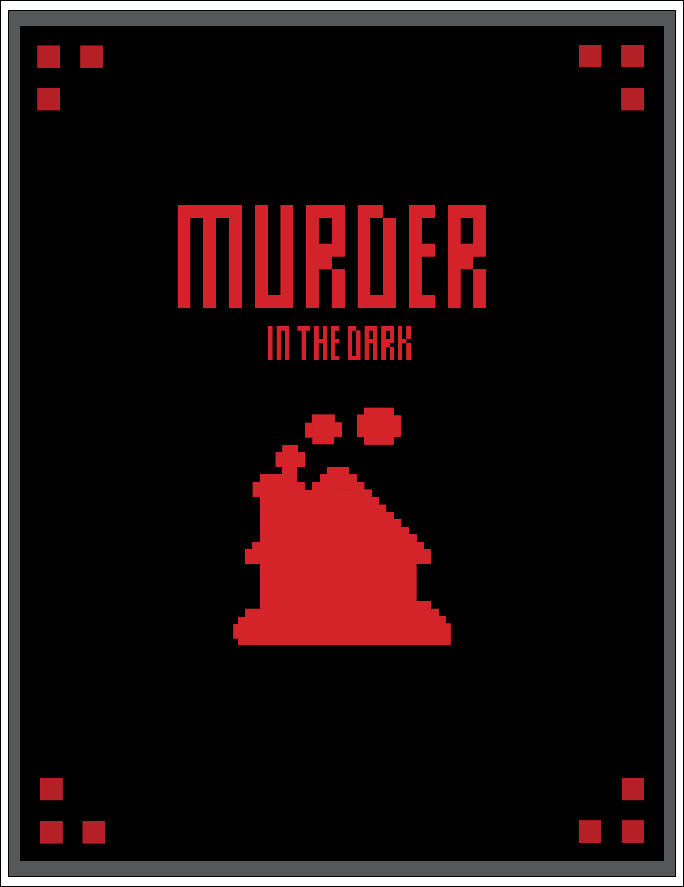

# Murder In the Dark: The Web App



This repository contains the code to digitaly run a full game of murder in the dark, a murder mystery party game played around a house. It is a full-stack application built with a React client and a Node.js server. The project is structured into two main parts: the `client` and the `server`, with a root configuration for managing dependencies and scripts across the whole project.

[Murder in the Dark Rules](https://deadherring.co.uk/murder-in-the-dark/#:~:text=If%20players%20come%20across%20someone,correctly%2C%20they%20win%20the%20game.)
## Project Structure

```
/murder-web-app
  /client        # React frontend
    package.json
  /server        # Node.js backend
    package.json
  package.json   # Root package.json for shared scripts and dependencies
```

### Client
The `client` folder contains the React application, which serves as the frontend of the project. It is built with React and managed with its own `package.json`.

### Server
The `server` folder contains the Node.js application, which serves as the backend of the project. It is responsible for handling server-side functionality.

---

## Prerequisites
To run this project, ensure you have the following installed:
- [Node.js](https://nodejs.org/) (v16 or higher recommended)
- [npm](https://www.npmjs.com/)

---

## Getting Started

### 1. Clone the Repository
```bash
git clone https://github.com/JackMuir1/Murder-Web-App.git
cd Murder-Web-App

```

### 2. Install Dependencies
Install dependencies for both the `client` and `server` (commands from the project root):
```bash
# Install root dependencies
npm install

# Install client dependencies
cd client
npm install

# Install server dependencies
cd ../server
npm install
```

## Running the Application

### 1. Start the Server
Navigate to the `server` folder and start the backend:
```bash
cd server
npm start
```
By default, the server will run on `http://localhost:4000`.

### 2. Start the Client
Navigate to the `client` folder and start the frontend:
```bash
cd client
npm start
```
By default, the client will run on `http://localhost:3000`.

---

## Contributing
If you would like to contribute:
1. Fork the repository.
2. Create a new feature branch (`git checkout -b feature-name`).
3. Commit your changes (`git commit -m 'Add feature-name'`).
4. Push to the branch (`git push origin feature-name`).
5. Open a Pull Request.

---

## License
This project is licensed under the [MIT License](LICENSE).

---

## Things to Add
- Full timer functionality
- Voting rounds
- Better Websocket Handling
- Tutorial Page

